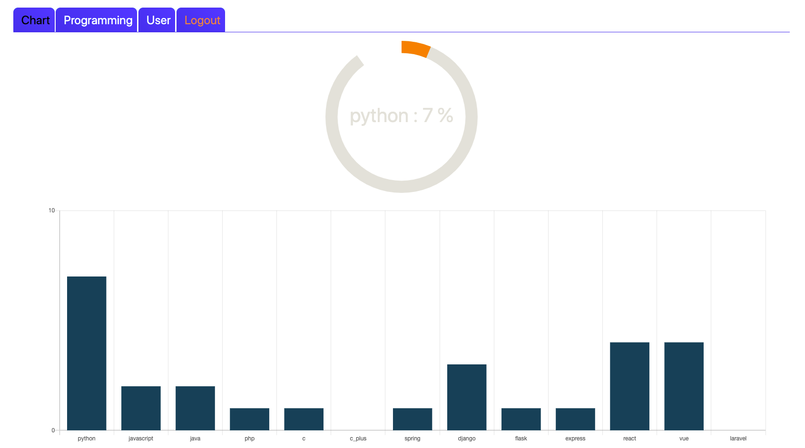

# dev-Chart

# Back-end

### Django

**Django REST API , Mysql , Modeling**

pip install -r requirements.txt

create database

python manage.py makemigrations

python manage.py migrate

python manage.py runserver

image

**진행기간: 2020년 12월 28일 ~ 2021년 1월 8일**

> 회원가입과 로그인후 사용하는 언어를 선택하게되면
> 가입된 개발자들이 사용하는 언어 와 프레임워크 도표를 볼 수 있습니다.

# Front-end

### React js

**React js , React Hooks, Redux , Redux-saga**

yarn install

yarn start
